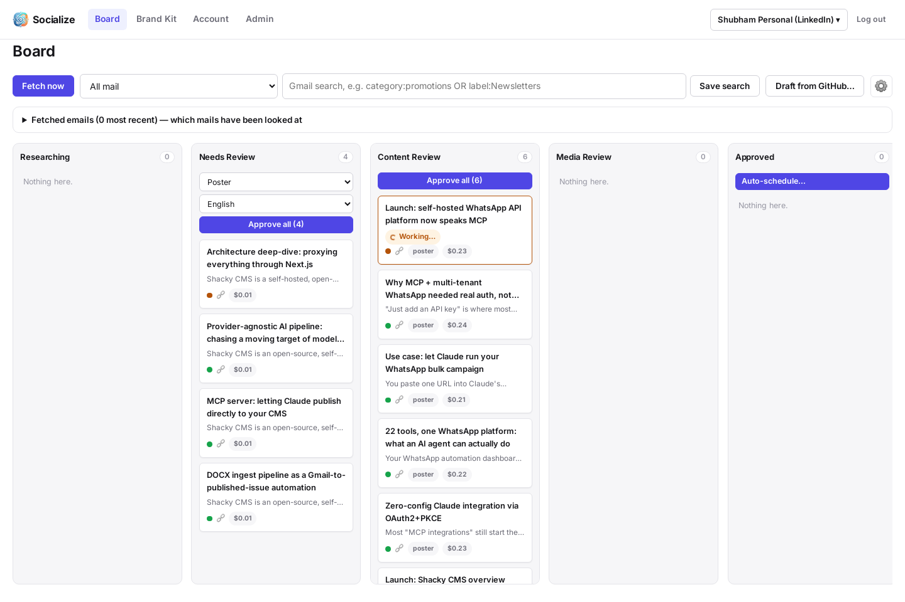
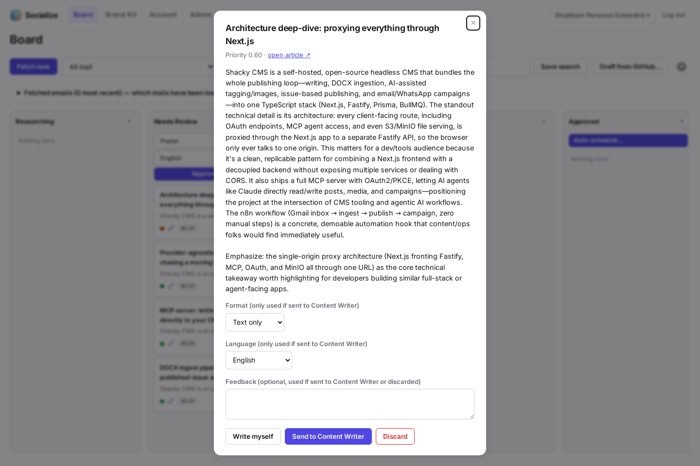
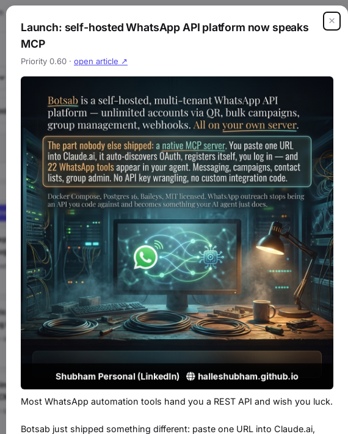
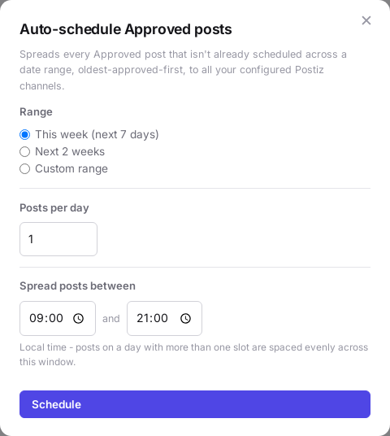
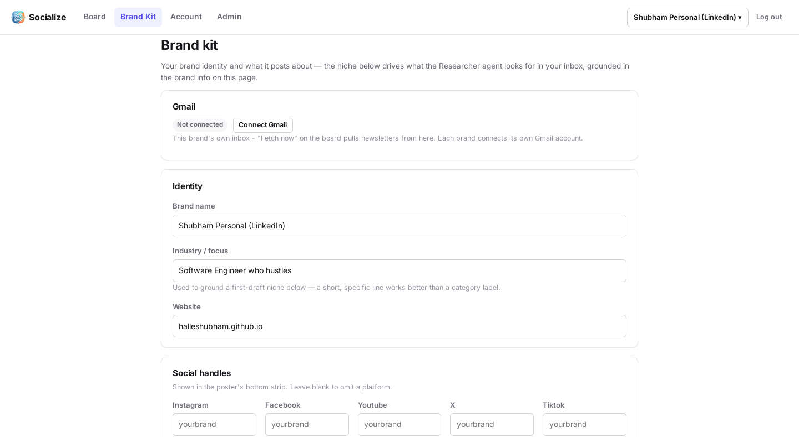
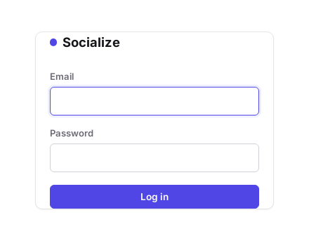

# Socialize

**Turn your newsletter inbox into a review-and-publish pipeline for social media posts.**

Socialize watches your Gmail inbox, finds newsletter articles worth posting about, drafts on-brand captions and AI-generated posters, reels, or carousels, and hands you a Kanban board to review, tweak, and publish — via WhatsApp or [Postiz](https://postiz.com/) — without ever leaving the app. It supports multiple brands per user, each with its own inbox, niche, identity, and publishing destinations, and is open for public self-serve signup with bring-your-own-key AI billing — there's no shared bill, you connect your own provider keys.



## What it does

1. **Fetches** newsletters from a brand's connected Gmail inbox (scheduled daily, or on demand).
2. **Researches** each email, pulling out every distinct article worth considering (not just one per email) and scoring it against the brand's niche.
3. **Analyzes** the article and drafts a strategic brief — why this matters for the brand's audience, what angle to take.
4. **Drafts** the actual post: caption, hashtags (via live web search), and a poster headline, reel script, or carousel script, in the brand's chosen language.
5. **Generates** a finished poster (AI background + on-brand headline typography, brand strip with logo/handles), a short video reel (AI-generated scenes, stitched together with narration), or a 4-6 slide carousel (each slide a distinct AI-generated image, one consistent style across the set).
6. **Reviews** — every step above pauses for your approval on the board; edit, regenerate, or discard at any gate. A dedicated full-page review is available for reels specifically. Turn on Auto Mode to skip review for high-confidence items.
7. **Publishes** — send an approved post straight to WhatsApp, or schedule it (individually or in bulk, spread across a date range) to your Postiz-connected social channels.

## Screenshots

| | |
|---|---|
| **Kanban board** — one card per post, from source (a newsletter or a GitHub repo) to published | **Review gate** — every draft, brief, and image is a decision point |
|  |  |
| **Generated poster** — AI background, on-brand typography, source attribution | **Bulk auto-scheduling to Postiz** — spread a queue of approved posts across a date range |
|  |  |
| **Brand kit** — one brand's identity, niche, and connections | **Login** |
|  |  |

## Features

- **Open, self-serve, bring-your-own-key** — anyone can register at `/signup` (with optional real email verification via [Resend](https://resend.com/)); no shared AI bill, each brand owner connects their own LLM/image/video provider keys, so the platform never resells or meters AI spend on its own account.
- **Multi-brand, multi-user** — each brand has its own Gmail inbox, niche, identity, logo, and publishing credentials. Brand owners can share a brand with other users; API/LLM costs always bill to the owner. A superadmin tier controls who else can become an admin.
- **Four content sources, or skip sourcing entirely** — Gmail newsletters, a connected GitHub repo's own activity, RSS feeds, and a WooCommerce/Shopify product catalog. Or just type an idea directly — no inbox/repo/catalog needed, drafts straight from what you write.
- **LLM-agnostic and per-brand configurable** — every pipeline step (research, drafting, image direction, shot-listing) can be pointed at a different model per brand, with a sane global default. Backed by [LiteLLM](https://github.com/BerriAI/litellm), so swapping providers is a config change, not a code change.
- **Combined drafting mode** — an optional cheaper path that drafts the brief and the post copy in one LLM call instead of two, configurable per brand.
- **Poster generation** — six content-aware templates (quote, tribute, narrative, fact/critique, trivia, event) inferred automatically per article, rendered by an AI image model with brand-strip compositing (logo, social handles, website).
- **Reel generation** — script + shot list drafted from the real article, AI-generated video scenes (Veo) chained for character consistency, with narration carrying every fact/quote (no on-screen text) — a per-reel cost cap, and a dedicated full-page review for the script/shot-list/narration editing.
- **Carousel generation** — a 4-6 slide picture series, each slide a genuinely distinct AI-generated image (not one background reused with different captions) tied together by a shared style guide, with an AI-drawn page-counter.
- **Multilingual** — English, Hindi, and Marathi content generation, including correct Devanagari rendering (a known weak point for AI image/video models) and a dedicated pre-generation text-review step for Hindi/Marathi so you can fix the exact final wording before spending real generation cost.
- **Human-in-the-loop, with an escape hatch** — every stage is a review gate by default; Auto Mode can auto-advance and auto-send anything clearing a configurable priority score.
- **Publishing** — send an approved post to WhatsApp (via a self-hosted [Botsab](https://github.com/) instance) or to any number of Postiz-connected social channels, immediately or scheduled.
- **Bulk auto-scheduling** — queue every approved-but-unpublished post across "this week," "next 2 weeks," or a custom range, at a configurable posts-per-day cadence, spaced out to respect Postiz's API rate limit, with a visible loading state while a batch is running.
- **Per-post cost tracking** — every LLM call and generated asset's cost rolls up into a running total shown right on the card.
- **Account lifecycle** — self-service account/brand deletion, a data export, admin deactivate/reactivate, and secrets-key rotation without re-encrypting existing data.

## How it's built

A [LangGraph](https://github.com/langchain-ai/langgraph) state graph per article (`content_item`), with `interrupt()` at every human-review gate and Postgres-backed checkpointing so a run can pause indefinitely and resume exactly where it left off:

```
Gmail / GitHub / RSS / product catalog fetch (daily, or on demand)
  -> Researcher extracts every article/angle from the source
  (or: type an idea directly -> skips fetch + Researcher entirely)
  -> per article: fetch full text -> Analytical brief -> [review]
       -> Content Writer (caption/hashtags/headline) -> [review]
            -> poster:    Graphic Designer -> [review] -> Approved
            -> reel:      Reel Editor      -> [review] -> Approved
            -> carousel:  Carousel Editor  -> [review] -> Approved
            -> text-only -> Approved
       -> Approved -> WhatsApp / Postiz (now, or scheduled)
```

**Stack**: FastAPI + Jinja2 (server-rendered, no SPA build step) · SQLAlchemy 2.0 + Alembic · Postgres (also backs LangGraph's checkpointer) · Redis (infrastructure for future multi-replica state; not yet consumed) · LiteLLM (Anthropic / OpenAI / Google, per-task configurable) · Google Gemini for image generation, Veo for video · Pillow + ffmpeg for deterministic layout fallback and video stitching · Cloudflare R2 or local disk for storage · Resend for transactional email · Docker Compose for local dev, a GitHub Actions-built image on GHCR for deployment.

For the full design rationale, edge cases, and trade-offs behind each of the above, see [`docs/architecture.md`](docs/architecture.md) — it's written as a running engineering log, kept up to date as the system grows.

## Getting started

Requires Docker and Docker Compose.

```bash
git clone https://github.com/halleshubham/Socialize.git
cd Socialize
cp .env.example .env
```

Edit `.env`:

- `APP_SECRET_KEY` — any long random string (session signing).
- `APP_ENCRYPTION_KEY` — generate with `python -c "from cryptography.fernet import Fernet; print(Fernet.generate_key().decode())"` (encrypts stored OAuth tokens and API keys at rest).
- `ADMIN_EMAIL` / `ADMIN_PASSWORD` — your bootstrap **superadmin** account, created automatically on first startup. Superadmin is the one tier that can grant admin status to other accounts; everything else about a normal user account works the same for it.

Everything else in `.env.example` is optional at boot — LLM provider keys, Gmail, WhatsApp, Postiz, Redis, and Resend (email verification) can all be configured later, and most of it per-brand, from inside the app.

```bash
docker compose up --build
```

This runs migrations and starts the app (with auto-reload) at **http://localhost:8000**.

1. Log in with `ADMIN_EMAIL` / `ADMIN_PASSWORD` — that's your superadmin account. (Anyone else can now also self-register at `/signup`, no invite needed.)
2. You'll land on **Create a brand** — give it a name, niche/industry, and identity details.
3. Connect its Gmail inbox from the Brand Kit page (**Connect Gmail** — a normal in-app OAuth flow; see [Connecting Gmail](#connecting-gmail) below for the one-time Google Cloud setup it needs).
4. Add LLM provider keys at `/account` (or set a shared fallback in `.env`).
5. Click **Fetch now** on `/board` and watch cards move through the pipeline.

Anyone can self-register at `/signup`; an admin can also still create an account directly at `/admin/users` for out-of-band onboarding. Either way, give a user access to a brand from that brand's Kit page. If `RESEND_API_KEY`/`RESEND_FROM_EMAIL` aren't set, self-serve signups are auto-verified (no email round-trip) rather than left unable to log in.

### Connecting Gmail

Create an OAuth client in [Google Cloud Console](https://console.cloud.google.com/) (Desktop app type for local dev at `localhost`; Web application type with your real domain's `/brand-kit/gmail/callback` registered, for a real deployment), download the client JSON, and place it at:

```bash
cp your-downloaded-client.json secrets/gmail_credentials.json
```

Then click **Connect Gmail** on a brand's Brand Kit page. Each brand connects its own inbox independently.

### Connecting WhatsApp (optional)

Socialize sends via a self-hosted [Botsab](https://github.com/) instance (a REST wrapper over WhatsApp Web). Set a shared `BOTSAB_BASE_URL`/`BOTSAB_API_KEY`/`BOTSAB_INSTANCE_ID` in `.env`, or let each brand connect its own instance/number from its Brand Kit page.

### Connecting Postiz (optional)

Point `POSTIZ_BASE_URL` at your self-hosted [Postiz](https://postiz.com/) instance, then set an API key and pick channels per brand from its Brand Kit page — Postiz's own connected-channel list is fetched live so you just tick the ones you want.

### Enabling email verification (optional)

Set `RESEND_API_KEY` and `RESEND_FROM_EMAIL` (a [Resend](https://resend.com/) account and an address on a domain verified there) to require self-serve signups to click a confirmation link before they can log in. Without these set, new signups are auto-verified instead — no lockout, no email infra required to run the app at all.

### Verifying things independently

```bash
# Check your configured LLM provider keys actually work
docker compose exec app python -m backend.scripts.check_providers

# Seed one test content item through Researcher/Analytical without Gmail connected
docker compose exec app python -m backend.scripts.seed_test_content_item
```

## Project layout

```
backend/
  agents/          LangGraph nodes: researcher, analytical, content_writer,
                    graphic_designer, reel_editor, carousel_editor, orchestrator
  app/
    api/           FastAPI routes (board, brand kit, admin, auth, ...)
    auth/          Auth backend, brand-access dependencies, email verification
    db/            SQLAlchemy models + Alembic migrations
    integrations/  Gmail, GitHub, RSS, WooCommerce, WhatsApp (Botsab), Postiz,
                    Resend (email), article-text extraction
    llm/           Provider routing, per-user API keys, image/video providers
    storage/       Pluggable storage backend (local disk or Cloudflare R2)
    templates/     Server-rendered Jinja2 pages
    worker/        Background task pool + the daily fetch schedulers
docs/
  architecture.md  Detailed design log - the "why", not just the "what"
.github/workflows/
  docker-publish.yml  Builds and pushes the app image to GHCR on every push to main
```

## Deployment

The app image is built and published to `ghcr.io/halleshubham/socialize` automatically on every push to `main` (`.github/workflows/docker-publish.yml`) — a deploy target just pulls the pre-built image rather than building on the server itself. The Dockerfile's own `CMD` runs migrations before starting the server, so the image is self-sufficient on any platform (Coolify, plain `docker run`, etc.), not dependent on a deploy platform's own start-command override. See [`docs/architecture.md`](docs/architecture.md#deployment-coolify--ghcr) for the full write-up, including which env vars are genuinely required infra config versus bring-your-own-key.

## License

[MIT](LICENSE)
